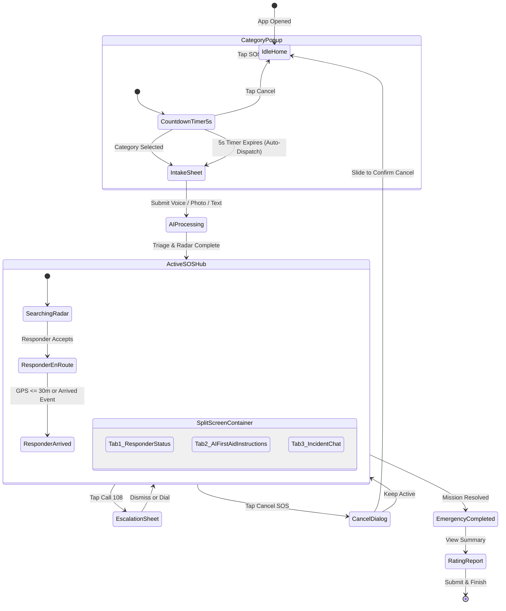
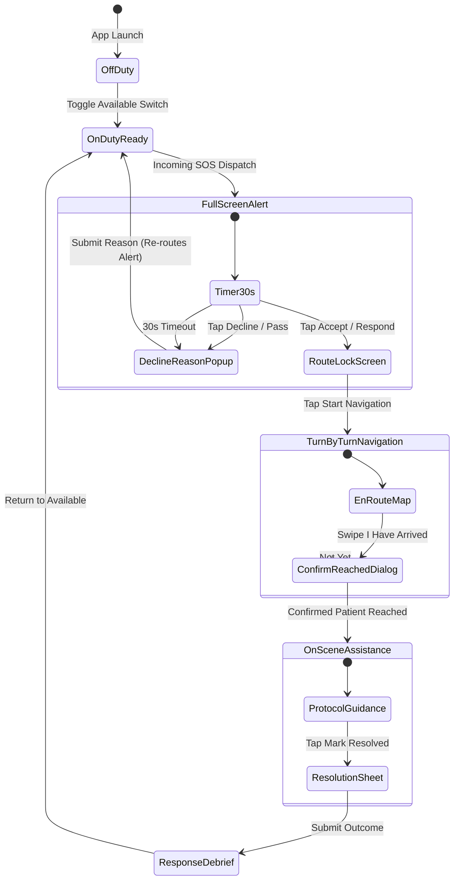

# NearHelp AI — Comprehensive UI/UX Design & Architecture Specification

> **Document Version**: 1.0.0  
> **Target Platform**: Android (Jetpack Compose / Kotlin) & Cross-Platform Mobile  
> **Design Strategy**: Dual-Persona (Victim & Community Responder), High-Urgency Stress-Resilient UI, Light Mode Default with Dark Mode Preference  
> **Status**: Approved via Comprehensive Architecture & Design Review  

---

## 📑 Table of Contents

1. [Executive Summary & Design Philosophy](#1-executive-summary--design-philosophy)
2. [Design System, Color Tokens & Typography](#2-design-system-color-tokens--typography)
3. [Screen & Pop-up Architecture Matrix](#3-screen--pop-up-architecture-matrix)
4. [Persona 1: Victim / Person Requesting Help](#4-persona-1-victim--person-requesting-help)
   - [Screen V1: Welcome / Authentication](#screen-v1-welcome--authentication)
   - [Screen V2: Permissions & Emergency Access Setup](#screen-v2-permissions--emergency-access-setup)
   - [Screen V3: Medical ID & Emergency Contacts (ICE)](#screen-v3-medical-id--emergency-contacts-ice)
   - [Screen V4: Home / SOS Main Screen](#screen-v4-home--sos-main-screen)
   - [Pop-up V-P1: Emergency Category Selector (5s Auto-Dispatch)](#pop-up-v-p1-emergency-category-selector-5s-auto-dispatch)
   - [Pop-up V-P2: Multi-Modal Emergency Description Bottom Sheet](#pop-up-v-p2-multi-modal-emergency-description-bottom-sheet)
   - [State V-S1: AI Processing & Triage Analysis](#state-v-s1-ai-processing--triage-analysis)
   - [Screen V5: Active SOS — Unified Split-Screen Hub](#screen-v5-active-sos--unified-split-screen-hub)
     - [Top 40%: Interactive Live GPS Tracking Map](#top-40-interactive-live-gps-tracking-map)
     - [Bottom 60% Tab 1: Responder Status & Radar](#bottom-60-tab-1-responder-status--radar)
     - [Bottom 60% Tab 2: AI First-Aid Instructions & TTS Audio Coach](#bottom-60-tab-2-ai-first-aid-instructions--tts-audio-coach)
     - [Bottom 60% Tab 3: Incident Chat & Automated Timeline](#bottom-60-tab-3-incident-chat--automated-timeline)
   - [Pop-up V-P3: Emergency Services Escalation (108/112) Bottom Sheet](#pop-up-v-p3-emergency-services-escalation-108112-bottom-sheet)
   - [Pop-up V-P4: False Alarm / Cancel SOS Confirmation Dialog](#pop-up-v-p4-false-alarm--cancel-sos-confirmation-dialog)
   - [Pop-up V-P5: Responder Arrival Alert Pop-up](#pop-up-v-p5-responder-arrival-alert-pop-up)
   - [Screen V6: Emergency Completed Screen](#screen-v6-emergency-completed-screen)
   - [Screen V7: Post-Incident Rating & Safety Report Screen](#screen-v7-post-incident-rating--safety-report-screen)
5. [Persona 2: Responder Side Experience](#5-persona-2-responder-side-experience)
   - [Screen R1: Responder Onboarding & Credential Verification](#screen-r1-responder-onboarding--credential-verification)
   - [Screen R2: Responder Home & Readiness Screen](#screen-r2-responder-home--readiness-screen)
   - [Screen R3: Full-Screen Urgent Emergency Alert (Incoming Call Style)](#screen-r3-full-screen-urgent-emergency-alert-incoming-call-style)
   - [Pop-up R-P1: Decline Reason Modal Pop-up](#pop-up-r-p1-decline-reason-modal-pop-up)
   - [Screen R4: Response Accepted & Route Lock Screen](#screen-r4-response-accepted--route-lock-screen)
   - [Screen R5: Live Turn-by-Turn Navigation Screen (En-Route)](#screen-r5-live-turn-by-turn-navigation-screen-en-route)
   - [Pop-up R-P2: Confirm Patient Reached Pop-up Dialog](#pop-up-r-p2-confirm-patient-reached-pop-up-dialog)
   - [Screen R6: On-Scene Assistance Screen (Arrived)](#screen-r6-on-scene-assistance-screen-arrived)
   - [Pop-up R-P3: Emergency Handover & Resolution Bottom Sheet](#pop-up-r-p3-emergency-handover--resolution-bottom-sheet)
   - [Screen R7: Response Completed & Debrief Screen](#screen-r7-response-completed--debrief-screen)
6. [State Machine & Navigation Flow Diagrams](#6-state-machine--navigation-flow-diagrams)
7. [Accessibility, Haptics & Legal Compliance Standards](#7-accessibility-haptics--legal-compliance-standards)

---

## 1. Executive Summary & Design Philosophy

**NearHelp AI** is a life-saving, AI-assisted community emergency response network connecting victims in acute distress with nearby verified medical volunteers, off-duty doctors, and trained first-responders before professional EMS (108/112) arrives.

### Core UX Principles
1. **Zero-Friction Emergency Access**: Immediate guest SOS trigger without requiring login, credentials, or email verification during distress.
2. **Cognitive Load Reduction**: In severe stress, fine motor control degrades. Touch targets must be oversized (minimum 72dp for SOS), high contrast, with clear visual icons.
3. **Modal Protection & Situational Awareness**: Emergency flows must not bury the user under multi-layered screen navigations. Contextual interactions (Category picking, 108 escalation, cancel confirmations) are delivered as lightweight **Pop-up Modals and Bottom Sheets** over the active scene.
4. **Non-Dismissible Legal Safeguards**: All AI first-aid guidance strictly complies with India’s Good Samaritan Law (2016) and WHO/Red Cross protocols, featuring persistent non-dismissible disclaimers.
5. **Split-Screen Active Orchestration**: During active rescue, the victim's screen provides a split view: top 40% persistent real-time GPS map and bottom 60% tabbed container separating responder status, AI medical checklist, and live chat.
6. **Distinct Two-Phase Responder Experience**: Responders benefit from a clean separation between en-route **Turn-by-Turn Navigation** and on-scene **Medical Intervention Assistance**.

---

## 2. Design System, Color Tokens & Typography

The application adopts a clean, high-clarity **Light Mode Default** with an optional **Dark Mode Preference** (optimized for night emergencies and OLED power saving).

### 2.1 Color Palette Tokens

| Token Name | Light Mode Hex | Dark Mode Hex | Usage & Semantic Context |
| :--- | :--- | :--- | :--- |
| **Emergency Red (Primary)** | `#D32F2F` | `#E53935` | Main SOS Button, Critical Severity Level 5, Urgent Alarm |
| **Action Amber (Secondary)** | `#ED6C02` | `#FF9800` | Warning, Moderate Severity Level 3-4, En-route status |
| **Safe Green** | `#2E7D32` | `#4CAF50` | Responder Arrived, Safe Status, Verified Doctor Badge |
| **AI Info Blue** | `#0288D1` | `#2196F3` | AI Triage Badge, First-Aid Protocol Card, System Alerts |
| **Background Primary** | `#F8F9FA` | `#121212` | Main screen background |
| **Card / Surface** | `#FFFFFF` | `#1E1E1E` | Card containers, bottom sheets, dialog modals |
| **Surface Variant** | `#F1F3F4` | `#2C2C2C` | Secondary chip backgrounds, input text boxes |
| **Text Primary** | `#1A1C1E` | `#FFFFFF` | High-contrast headings, critical instruction text |
| **Text Secondary** | `#5F6368` | `#B0BEC5` | Metadata, timestamps, supporting labels |
| **Divider / Border** | `#E0E0E0` | `#333333` | Card borders, bottom sheet handles, table rules |

### 2.2 Typography & Touch Targets
* **Font Family**: Inter or Roboto (Modern sans-serif optimized for mobile legibility).
* **Display Bold (SOS)**: 32sp / 36sp, Bold, uppercase for emergency alerts.
* **Header 1 (Screen Titles)**: 22sp, Semi-Bold.
* **Header 2 (Section Cards)**: 18sp, Medium.
* **Body Primary (Action Steps)**: 16sp, Regular (16sp+ for AI first-aid steps to ensure rapid readability).
* **Caption / Meta**: 12sp, Regular.
* **Touch Targets**: Standard buttons $\ge 48\text{dp} \times 48\text{dp}$; SOS triggers $\ge 84\text{dp} \times 84\text{dp}$.

### 2.3 Haptics & Sound Signals
* **SOS Press**: Heavy double-vibration haptic pulse (`HapticFeedbackType.LongPress`).
* **Category Selection**: Crisp haptic click (`HapticFeedbackType.TextHandleMove`).
* **Responder Incoming Alert**: Continuous high-priority siren/vibration pattern bypassing Android Do-Not-Disturb (FCM High Priority + Full Screen Intent).

---

## 3. Screen & Pop-up Architecture Matrix

| ID | Title | UI Type | Persona | Purpose |
| :--- | :--- | :--- | :--- | :--- |
| **V1** | Welcome / Authentication | Full Screen | Victim | Google, Phone OTP, & Emergency Guest Access |
| **V2** | Permissions & Access Setup | Full Screen | Victim | Grant Always Location, Mic, Cam, Full-Screen Intent |
| **V3** | Medical ID & Contacts (ICE) | Full Screen | Victim | Blood type, allergies, ICE emergency contact setup |
| **V4** | Home / SOS Main | Full Screen | Victim | Pulsing SOS button, GPS location, quick AI entry |
| **V-P1** | Emergency Category Selector | Modal Pop-up | Victim | 5s countdown modal (Medical, Fire, Crime, Accident) |
| **V-P2** | Multi-Modal Intake Sheet | Bottom Sheet | Victim | Photo capture, hold-to-speak voice recorder, text |
| **V-S1** | AI Processing & Triage | State / Overlay | Victim | Real-time classification & dispatch radar |
| **V5** | Active SOS Hub | Split Screen (40/60) | Victim | Top: Live GPS map; Bottom: 3 Tabbed Containers |
| **V-P3** | Escalation (108/112) Sheet | Bottom Sheet | Victim | Fast direct-dial to Ambulance, Police, Fire |
| **V-P4** | False Alarm / Cancel Dialog | Modal Dialog | Victim | Accidental cancellation prevention + reason |
| **V-P5** | Responder Arrival Notice | Pop-up Banner | Victim | Prompt confirming responder arrival on scene |
| **V6** | Emergency Completed | Full Screen | Victim | Incident outcome recap and responder profile |
| **V7** | Post-Incident Rating & Report | Full Screen | Victim | 5-star rating, responder tags, abuse/safety report |
| **R1** | Responder Onboarding & ID | Full Screen | Responder | Medical credentials, license/CPR upload & status |
| **R2** | Responder Home & Readiness | Full Screen | Responder | Availability toggle, coverage radius, incident stats |
| **R3** | Incoming Emergency Alert | Full Screen Alert | Responder | Urgent incoming call-style alarm, accept/decline |
| **R-P1** | Decline Reason Modal | Modal Pop-up | Responder | 1-tap decline reason to trigger instant re-dispatch |
| **R4** | Response Accepted Screen | Full Screen | Responder | Location lock, route calculation, transit mode |
| **R5** | Live Navigation (En-Route) | Full Screen | Responder | Turn-by-turn map route, live ETA, patient preview |
| **R-P2** | Confirm Patient Reached | Modal Dialog | Responder | Verification dialog to prevent premature arrival tap |
| **R6** | On-Scene Assistance (Arrived) | Full Screen | Responder | Full Medical ID, AI CPR/protocol coach, handover |
| **R-P3** | Handover & Resolution Sheet | Bottom Sheet | Responder | Resolution outcome (108 Handover, Stabilized, etc.) |
| **R7** | Response Completed Debrief | Full Screen | Responder | Response duration, impact badge, return to available |

---

## 4. Persona 1: Victim / Person Requesting Help

### Screen V1: Welcome / Authentication
* **Layout**: Clean, reassuring hero screen.
* **Components**:
  * App branding: NearHelp logo with emergency beacon icon.
  * Headline: *"Community Emergency Response Network — Help is Seconds Away"*.
  * **Primary Red Button**: `🚨 EMERGENCY GUEST ACCESS (NO LOGIN REQUIRED)` — Immediately grants guest access directly into the Home/SOS screen.
  * **Divider**: *"or sign in for personalized Medical ID"*
  * `Continue with Google` (One-Tap button).
  * `Continue with Phone Number` (SMS OTP verification).
* **Rationale**: Life-or-death situations cannot wait for user password recovery or authentication token handshakes.

---

### Screen V2: Permissions & Emergency Access Setup
* **Layout**: Step-by-step permission onboarding guide with visual explainer cards.
* **Components**:
  * **Location (Allow All The Time)**: Essential for background geofencing and dispatching nearest responders.
  * **Microphone**: For voice SOS intake and AI hands-free guidance.
  * **Camera**: For injury/scene photo triage.
  * **Full-Screen Alarm & Bypass DND**: For waking device during emergency updates.
  * **Grant Permissions Button** (Triggers standard Android permission sheet).
  * **Skip to SOS** link at bottom.

---

### Screen V3: Medical ID & Emergency Contacts (ICE)
* **Layout**: Profile configuration screen accessible from Settings or post-onboarding.
* **Components**:
  * **Personal Information**: Full name, Date of birth, Blood Group dropdown (`A+`, `A-`, `B+`, `B-`, `AB+`, `AB-`, `O+`, `O-`).
  * **Critical Medical Conditions**: Tag input (e.g., Asthma, Diabetic, Epilepsy, Heart Condition).
  * **Severe Allergies**: Tag input (e.g., Penicillin, Latex, Peanuts).
  * **Current Medications**: Free-form text.
  * **Emergency Contacts (ICE)**: Add up to 3 contacts (Name, Relationship, Phone Number).
  * **Auto-Notify Toggle**: *"Automatically send SMS distress beacon with live GPS coordinates to ICE contacts upon SOS trigger"*.
  * `Save Medical ID` button.

---

### Screen V4: Home / SOS Main Screen
* **Layout**: Centered, high-urgency distress screen designed for rapid one-handed trigger.
* **Header**:
  * Current GPS address pill with accuracy indicator (e.g., *"📍 Park Street, Kolkata (Accurate to 4m)"*).
  * Medical ID profile avatar icon (top-right).
* **Center Section**:
  * **Large SOS Button**: Red circular button ($120\text{dp} \times 120\text{dp}$) with subtle animated concentric ripple pulses.
  * Bold text inside button: **`SOS`**.
  * Subtitle below button: *"Tap once for instant emergency help"*.
* **Bottom Toolbar**:
  * `🤖 AI Medical Assistant` quick entry chip (for non-urgent medical protocol consultations).
  * `🔒 Anonymous Emergency Mode` toggle switch (masks victim name from public responders).
  * `Offline Backup Indicator`: Displays when data is absent (*"Cellular Fallback Active — SMS Dispatch Ready"*).

---

### Pop-up V-P1: Emergency Category Selector (5s Auto-Dispatch)
* **UI Type**: Modal Pop-up Dialog (dimmed background overlay).
* **Trigger**: Tapping the SOS button on Screen V4.
* **Layout & Behavior**:
  * **Top Header**: *"What kind of emergency is this?"*
  * **Circular Progress Timer**: **5-second animated countdown timer** prominently displayed.
  * **Auto-Dispatch Logic**: If the user freezes or passes out and 5 seconds expire, the system **automatically dispatches a Critical General/Medical Emergency** to prevent loss of life.
  * **4 Category Touch Cards** (Large 64dp buttons with icons):
    1. 🩺 **Medical / Cardiac / Unconscious**
    2. 🚗 **Road Accident / Trauma**
    3. 🔥 **Fire / Explosion / Hazard**
    4. 🛡️ **Crime / Physical Threat**
  * Tapping any category **immediately cancels the countdown and advances** to the Multi-Modal Intake Bottom Sheet (Pop-up V-P2).
  * **Cancel Button** (Small text button at bottom): *"Cancel (False Alarm)"*.

---

### Pop-up V-P2: Multi-Modal Emergency Description Bottom Sheet
* **UI Type**: Interactive Modal Bottom Sheet (slides up from bottom, covering 65% of screen).
* **Header**:
  * Selected category pill (e.g., `🩺 Medical Emergency`).
  * Cancel link (top-right).
* **Multi-Modal Intake Options**:
  1. **🎙️ Hold-to-Speak Voice SOS**:
     * Large central microphone button.
     * While holding, dynamic audio waveform visualizer pulses in real time.
     * Automatically transcribed and fed to AI triage model on release.
  2. **📸 Take Photo of Scene / Injury**:
     * Quick camera capture button with thumbnail preview.
     * AI image analysis detects bleeding, burns, or unconsciousness markers.
  3. **⌨️ Quick Text Prompt / Symptom Chips**:
     * Quick tap tags: `Chest Pain`, `Heavy Bleeding`, `Not Breathing`, `Fracture`.
     * Optional text box: *"Type additional details..."*.
* **Primary Action**:
  * `DISPATCH & FIND HELP NOW` (Red full-width button).
  * Subtext: *"AI is currently analyzing inputs and pinging responders within 3km"*.

---

### State V-S1: AI Processing & Triage Analysis
* **UI Type**: Transitional State Overlay displayed immediately after dispatch while searching.
* **Components**:
  * Animated pulsing radar beacon.
  * **AI Triage Badge**:
    * Severity Level: `Level 4 — High Urgency (Suspected Cardiac Arrest / Hypoxia)`.
    * Recommended Protocol: `Adult CPR Protocol (WHO / Red Cross)`.
  * Status text: *"Dispatching to verified doctors and community volunteers within 1.5 km..."*.
  * Automatic transition to Screen V5 (Active SOS Hub).

---

### Screen V5: Active SOS — Unified Split-Screen Hub
* **Architecture**: **Split-Screen Layout** (Top 40% Fixed Interactive Map, Bottom 60% Swipeable 3-Tab Container).

```
┌────────────────────────────────────────────────────────┐
│ [TOP 40%]: PERSISTENT LIVE GPS TRACKING MAP            │
│  📍 Victim (Red Pulse)         🩺 Dr. Rahul (Blue 600m)│
│  🏥 Kolkata Medical College (1.2km)                    │
├────────────────────────────────────────────────────────┤
│ [BOTTOM 60%]: SWIPEABLE TABBED CONTAINER               │
│  [ Tab 1: Responder ] [ Tab 2: AI First-Aid ] [ Chat ] │
│ ────────────────────────────────────────────────────── │
│                                                        │
│  (Active Tab Content Renders Here)                     │
│                                                        │
├────────────────────────────────────────────────────────┤
│ [ESCALATION BAR]: [ 📞 CALL 108 AMBULANCE ] [ CANCEL ] │
└────────────────────────────────────────────────────────┘
```

#### Top 40%: Interactive Live GPS Tracking Map
* **Google Maps / MapLibre Integration**:
  * 📍 **Victim Pin**: Red pulsing beacon marking victim's exact GPS fix.
  * 🩺 **Approaching Responder Pin**: Blue marker displaying moving vehicle/walking icon and skill badge (Doctor / First-Aider).
  * 🏥 **Nearby Resource Pins**: Hospitals, AED locations, and 24x7 pharmacies.
  * Recenter button & live route polyline between responder and victim.

#### Bottom 60% Tab 1: Responder Status & Radar
* **State A (Searching)**:
  * Radar animation with live counter: *"Pinging 6 nearby responders (Radius expanding: 1km → 3km)"*.
* **State B (Responder Found & En Route)**:
  * **Responder Profile Card**:
    * Avatar photo with green verification checkmark.
    * Name: *"Dr. Rahul Sen"*.
    * Qualification Badge: `Verified MD / ACLS Certified`.
    * Live ETA Pill: `ETA: 3 mins (450m away)`.
    * Transit Mode: `Scooter / Two-Wheeler`.
  * **Quick Action Buttons**:
    * `📞 Call Responder` (VoIP / In-App masked voice call).
    * `💬 Open Incident Chat` (Switches to Tab 3).
  * **Live Status Indicator**:
    * Step 1: `SOS Accepted` (Completed)
    * Step 2: `En Route` (Active)
    * Step 3: `Arrived on Scene` (Pending)

#### Bottom 60% Tab 2: AI First-Aid Instructions & TTS Audio Coach
* **AI Protocol Checklist**:
  * Step-by-step interactive action checklist grounded in WHO & Red Cross emergency protocols.
  * Large checkable step cards (e.g.):
    * **Step 1: Check Responsiveness**: *"Tap victim firmly on shoulders and shout 'Are you okay?'"*.
    * **Step 2: Check Airway & Breathing**: *"Tilt head back gently and observe chest rise for 5 seconds."*.
    * **Step 3: Begin Chest Compressions**: *"Place heel of hand in center of chest. Push hard and fast at 100-120 BPM."*.
* **Audio Voice Coach**:
  * `🔊 Play Voice Guidance` button — Reads out first-aid steps loud and clear through device speaker with rhythmic metronome beep for CPR compressions.
* **Persistent Legal Disclaimer (Mandatory)**:
  ```
  ⚠️ DISCLAIMER: Guidance is based on WHO/Red Cross protocols and is NOT a substitute
  for professional medical advice. Protected under India's Good Samaritan Law (2016).
  Always call 108/112 for serious emergencies.
  ```

#### Bottom 60% Tab 3: Incident Chat & Automated Timeline
* **Real-Time WebSocket Chat Stream**:
  * Direct messaging between victim (or bystander) and the en-route responder.
  * Image and location sharing shortcuts.
* **Auto-Translation Banner**:
  * Automatically translates incoming messages (e.g., *"Translated from Bengali → English"*).
* **Automated Incident Milestones**:
  * `18:42:01 — SOS Triggered (Category: Medical)`
  * `18:42:15 — AI Triage Assigned: Level 4 High Urgency`
  * `18:42:38 — Dr. Rahul Sen Accepted SOS`
  * `18:44:10 — Responder is within 200m`

---

### Pop-up V-P3: Emergency Services Escalation (108/112) Bottom Sheet
* **UI Type**: Action Bottom Sheet modal.
* **Trigger**: Tapping the persistent `[ 📞 CALL 108 AMBULANCE ]` button on the active SOS screen.
* **Components**:
  * Heading: *"Contact Professional Emergency Services"*.
  * Subtext: *"NearHelp coordinates community volunteers. For severe emergencies, always dispatch professional EMS."*
  * **Quick Dial Options**:
    * 🚑 **Call 108 (Medical Emergency / Ambulance)** — Full-width red button.
    * 🚓 **Call 112 / 100 (National Emergency Helpline / Police)**.
    * 🚒 **Call 101 (Fire & Rescue)**.
  * **Status Update Checkbox**:
    * `[x] Mark in incident status that 108 has been called` (Informs responders and AI dispatch that ambulance is dispatched).

---

### Pop-up V-P4: False Alarm / Cancel SOS Confirmation Dialog
* **UI Type**: Modal Dialog with anti-accidental safety protection.
* **Trigger**: Tapping `Cancel SOS` on Screen V5.
* **Components**:
  * Warning Icon: Red triangle with exclamation.
  * Headline: *"Are you sure you want to cancel this emergency?"*.
  * Body: *"Responders currently en route will be notified that help is no longer required."*
  * **Reason Radio Selection**:
    * `Accidental SOS Trigger`
    * `Situation resolved without assistance`
    * `Professional EMS (108) already arrived`
    * `Other`
  * **Slide-to-Cancel Confirmation Slider**:
    * User must slide a button from left to right across 100% width to prevent unintentional taps.
  * **Keep SOS Active** (Primary button to dismiss dialog safely).

---

### Pop-up V-P5: Responder Arrival Alert Pop-up
* **UI Type**: High-Contrast Floating Alert Pop-up.
* **Trigger**: Automatically fires when responder's GPS is within 30 meters or responder taps "I Have Arrived".
* **Components**:
  * Headline: *"🟢 Responder Has Arrived!"*
  * Body: *"Dr. Rahul Sen has reached your location. Please identify yourself to the responder."*
  * Quick photo & vehicle details of the responder.
  * `Confirm Contact Made` button.

---

### Screen V6: Emergency Completed Screen
* **Layout**: Full-screen resolution summary.
* **Components**:
  * Large green checkmark icon: *"Emergency Response Completed"*.
  * Incident Summary Card:
    * Incident ID & Timestamp.
    * Total Duration (e.g., *"14 minutes"*).
    * Primary Responder: Dr. Rahul Sen.
    * Handover Status: Handed over to 108 Ambulance / First-Aid Administered.
  * `Proceed to Incident Review` button.

---

### Screen V7: Post-Incident Rating & Safety Report Screen
* **Layout**: Feedback and safety reporting full screen.
* **Components**:
  * Headline: *"How was the emergency assistance?"*
  * **5-Star Rating Bar** for Responder Dr. Rahul Sen.
  * **Quick Tag Chips**:
    * `Fast Arrival` | `Professional` | `Calm & Reassuring` | `Life-Saving Help`
  * **Optional Feedback Comments** text box.
  * **Safety / Misuse Reporting Section**:
    * `🚩 Report Safety Issue / Misconduct / Abuse` link (Opens incident dispute form).
  * `Submit Feedback & Return Home` button.

---

## 5. Persona 2: Responder Side Experience

The Responder experience is a specialized, high-readiness operational interface built for verified medical professionals, CPR certified citizens, and community volunteers.

### Screen R1: Responder Onboarding & Credential Verification
* **Layout**: Structured onboarding registration screen.
* **Components**:
  * **Basic Profile**: Name, contact, profile photo.
  * **Medical Qualification Tier**:
    * Tier 1: `Registered Medical Practitioner (Doctor / MBBS / MD)`
    * Tier 2: `Paramedic / Nurse / EMT`
    * Tier 3: `Certified First-Aider / Red Cross Volunteer`
    * Tier 4: `Good Samaritan Community Volunteer`
  * **Document Upload**:
    * Medical Registration Certificate / License number.
    * CPR / First-Aid Certificate (PDF or Camera capture).
    * Government ID (Aadhaar / Voter ID).
  * **Verification Status Badge**:
    * `Pending Review (Manual Verification in Progress)` or `Verified Responder (Active Badge)`.
  * `Submit Profile for Verification` button.

---

### Screen R2: Responder Home & Readiness Screen
* **Layout**: Dashboard displaying operational readiness and local incident activity.
* **Top Readiness Card**:
  * **Available / Unavailable Master Toggle Switch**:
    * Green: *"🟢 AVAILABLE TO RESPOND (Ready for Dispatches)"*.
    * Gray: *"⚪ UNAVAILABLE / OFF-DUTY"*.
  * Coverage Radius Slider: Adjustable between `500m` to `5km`.
* **Current Operational Status**:
  * GPS status: *"📍 High-Accuracy Location Active"*.
  * Active vehicle mode selector: `🚶 Walking` | `🛵 Two-Wheeler` | `🚗 Car`.
* **Responder Stats & History Card**:
  * Total Incidents Responded (e.g., `18`).
  * Lives Impacted metric.
  * Response History list with expandable past incident cards.

---

### Screen R3: Full-Screen Urgent Emergency Alert (Incoming Call Style)
* **UI Type**: **Full-Screen High-Priority Activity** (Bypasses lock screen and DND with urgent audible siren and haptic alert).
* **Behavior**:
  * Fires when backend AI dispatch algorithm selects the responder based on proximity and skill match.
  * **30-Second Response Countdown Timer**: Displays animated circular timer bar. If time expires, alert automatically re-routes to next closest responder.
* **Card Details**:
  * **Crisis Category Banner**: `🚨 MEDICAL EMERGENCY — CARDIAC ARREST` (Bright red).
  * **Severity Badge**: `Level 5 — Extreme Critical`.
  * **Distance & ETA Header**: `📍 650 meters away • ~3 mins by Scooter`.
  * **AI Incident Summary**: *"Male, approx 50 years, collapsed on street, unconscious, gasping for breath. Bystander holding voice SOS."*
  * **Skills Required**: `CPR Certified / AED Knowledge Needed`.
* **Action Buttons**:
  * 🟢 **`[ I'M RESPONDING / ACCEPT ]`** (Extra-large full-width green button).
  * ⚪ **`[ Decline / Pass ]`** (Gray outline button).

---

### Pop-up R-P1: Decline Reason Modal Pop-up
* **UI Type**: 1-Tap Modal Dialog.
* **Trigger**: Tapping `Decline / Pass` on Screen R3.
* **Purpose**: Captures immediate feedback to feed the AI re-dispatch algorithm in real time.
* **Options (1-Tap Selection)**:
  * `Too far / Traffic obstruction`
  * `Engaged in personal emergency / Busy`
  * `Lack required medical equipment`
  * `Accidental alert open`
* Tapping any option immediately dismisses alert and re-routes emergency to next candidate responder without delay.

---

### Screen R4: Response Accepted & Route Lock Screen
* **Layout**: Transitional confirmation screen confirming responder assignment.
* **Components**:
  * Large green confirmation badge: *"Response Accepted — Victim Notified"*.
  * Patient exact GPS coordinates locked.
  * Route preview with traffic highlights.
  * Selected transit mode toggle: `Scooter` | `Walking` | `Car`.
  * Primary Action: **`START NAVIGATION NOW`** (Advances to Screen R5).

---

### Screen R5: Live Turn-by-Turn Navigation Screen (En-Route)
* **UI Type**: **Full-Screen Turn-by-Turn Route Navigation View** (Designed for in-transit focus).
* **Components**:
  * **Top Navigation Bar**:
    * Turn maneuver icon (e.g., *"Turn right onto Park St in 150m"*).
    * ETA & Remaining Distance pill: `3 mins • 420m`.
  * **Full-Screen Map**:
    * Polyline path from responder's moving GPS pin to victim's pulsing beacon.
    * External Navigation shortcut: `Open in Google Maps` floating chip.
  * **Floating Quick Action Bar**:
    * `📞 Call Victim / Bystander` button.
    * `💬 Quick Chat` shortcut.
    * `📋 Medical ID Preview` chip (displays blood group and known allergies while en route).
  * **Bottom Arrival Action**:
    * **`[ 🟢 I HAVE ARRIVED / PATIENT REACHED ]`** (Large swipe-to-confirm button across screen width).

---

### Pop-up R-P2: Confirm Patient Reached Pop-up Dialog
* **UI Type**: Modal Verification Dialog.
* **Trigger**: Swiping `I Have Arrived` on Screen R5.
* **Components**:
  * Headline: *"Confirm Patient Contact"*.
  * Body: *"Are you with the victim now? Tapping confirm will transition you into on-scene clinical assistance mode."*
  * `Yes, I am with the patient` (Transitions to Screen R6).
  * `Not yet, still walking` (Dismisses dialog).

---

### Screen R6: On-Scene Assistance Screen (Arrived)
* **UI Type**: **Dedicated Clinical On-Scene Assistance Screen** (Switched automatically after arrival confirmation).
* **Components**:
  * **Patient Triage & Medical ID Card**:
    * Victim Name (or *"Anonymous Patient"*).
    * Blood Group: `B+` | Allergies: `Penicillin` | Conditions: `Hypertension`.
  * **AI Clinical Guidance & First-Aid Checklist**:
    * Specialized protocols for responders (e.g., Recovery position, Wound pressure, Splinting).
    * **CPR Cadence Metronome Tool**: Visual flashing circle with 110 BPM rhythmic audio beat for CPR compression timing.
  * **EMS Coordination Bar**:
    * Professional EMS Status: *"108 Ambulance Dispatched (ETA 8 mins)"*.
    * `📞 Contact 108 Dispatcher` button.
  * **Incident Timeline & Communication Log**:
    * Direct channel with emergency dispatch desk.
  * **Completion Trigger**:
    * **`[ MARK EMERGENCY AS RESOLVED ]`** (Full-width action button at bottom).

---

### Pop-up R-P3: Emergency Handover & Resolution Bottom Sheet
* **UI Type**: Modal Bottom Sheet.
* **Trigger**: Tapping `Mark Emergency as Resolved` on Screen R6.
* **Resolution Outcomes (Radio Selection)**:
  * `Handed over patient to 108 Ambulance / Paramedics`
  * `Patient stabilized on scene (No hospital transfer needed)`
  * `Patient transported via private vehicle to hospital`
  * `Patient refused care`
  * `False Alarm / Patient not found`
* **Clinical Notes Field**: Optional brief notes (e.g., *"Administered CPR for 4 minutes until EMS arrived"*).
* `Submit & Complete Mission` button.

---

### Screen R7: Response Completed & Debrief Screen
* **Layout**: Full-screen post-mission debrief screen.
* **Components**:
  * Celebration / Gratitude Graphic: *"Thank You, Responder! You made a life-saving difference."*.
  * Mission Stats Card:
    * Total Response Time: `12 mins 45s`.
    * Distance Traveled: `720m`.
    * Patient Outcome: Handed over to 108.
  * Contribution Badges earned (e.g., *"Community Hero Badge"*).
  * `Return to Available State & Home` button.

---

## 6. State Machine & Navigation Flow Diagrams

### 6.1 Victim SOS Lifecycle State Machine



---

### 6.2 Responder Alert & Dispatch Lifecycle State Machine



---

## 7. Accessibility, Haptics & Legal Compliance Standards

### 7.1 Good Samaritan Law Compliance (India, 2016)
* Every screen presenting medical instructions or AI advice MUST display the non-dismissible Good Samaritan legal card.
* **Statutory Notice**:
  > *"Guidance provided is based on recognized first-aid protocols (WHO/Red Cross) and does not constitute medical certification. Citizens rendering aid in good faith are fully protected from criminal and civil liability under the Good Samaritan Guidelines (Ministry of Road Transport & Highways, Govt. of India, 2016)."*

### 7.2 Accessibility & High-Stress Usability
1. **Touch Target Size**:
   * Minimum touch target for all buttons: $48\text{dp} \times 48\text{dp}$.
   * Emergency SOS and Accept buttons: $72\text{dp}$ to $120\text{dp}$.
2. **Color Contrast**:
   * All critical text conforms to WCAG 2.1 AAA standard (contrast ratio $\ge 7:1$ against surface).
3. **Screen Reader Compatibility**:
   * Every interactive composable must supply a descriptive `contentDescription` (e.g., `contentDescription = "Trigger Emergency SOS. 5-second countdown will begin."`).
4. **Haptic Feedback Mapping**:
   * SOS Button: Persistent heavy buzz.
   * Timer Tick: Subtle tick every second during 5s countdown.
   * Alert Arrival: Staccato alarm pulse.

### 7.3 Offline & Low-Connectivity Resilience
* If cellular internet connectivity drops during an active emergency:
  1. A high-contrast yellow alert banner appears: `⚠️ Offline Mode — Cellular Network Only`.
  2. The app automatically constructs an encrypted **Emergency SMS Distress Packet** containing:
     ```
     SOS#LAT:22.5521#LON:88.3512#CAT:MED#SEV:4#TIME:1718293910
     ```
  3. SMS is automatically dispatched via native SMS Gateway to **112** and registered **ICE Contacts**.
  4. The AI First-Aid checklist falls back to locally cached SQLite / JSON WHO/Red Cross protocol cards without needing internet access.

---

*End of Specification — NearHelp AI Design Architecture Document.*
