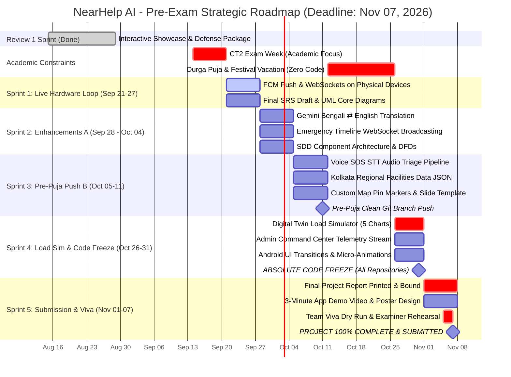

# NearHelp AI — Master Task Allocation, Strategy & Team Operating System

> **Project**: NearHelp AI (Emergency Response & AI Triage System)  
> **Team Size**: 6 Members · **Duration**: Accelerated Pre-November Sprint · **Modules**: 24 Core Modules  
> **Hard Deadline**: 🔴 **November 07, 2026 (First Week of November)** (Complete Academic Defense & Project Handover)  
> **Strategic Timeframe**: See [`docs/timeframe.md`](timeframe.md) for full calendar factoring in **CT2 Exam Week** (Sep 14–20) and **Durga Puja Vacation** (Oct 12–25) (~3 Weeks Academic/Festival Gap)  
> **Last Updated**: 2026-09-13  
> **Current Milestone**: 🟢 **Phase 1 Complete · 206/206 Tests Passing (90 Backend + 72 AI + 44 Android Unit Tests)**  
> **Next Milestone**: 🟡 **CT2 Exam Week (Sep 14–20) → Sprint 1 Live Hardware Loop (Sep 21–27)**

---

## 📑 Executive Overview & Operating Philosophy

This master plan combines technical architecture requirements with team governance strategies. It is built around four **Core Governance Principles**:

1. **Strict Module Isolation (Zero Code Overlap)**  
   No team member depends on another's code to build or test their own work. Critical infrastructure (Backend, Spatial DB, AI Engine) is strictly decoupled from auxiliary layers (UI layout components, static research, document reports).
2. **Frictionless Communication & Clear Ownership**  
   Every team member is assigned an exclusive domain with zero ambiguity. Cross-talk friction is eliminated using standard submission formats and objective criteria.
3. **Personality-Aligned Role Assignment**  
   Tasks match each member’s strengths, support networks, and technical background. High-friction roles are isolated with clear templates, supported roles receive pre-built UI specs, and non-blocking research roles ensure core velocity stays high.
4. **Fail-Safe Resilience (Contingency Coverage)**  
   Every role includes a non-intrusive backup mechanism. If any member underperforms or misses a deadline, the core platform (and Viva presentation) continues seamlessly.

---

## 👥 Team Roster & Strategic Responsibilities

| Member | Designated Role | Core Scope | Responsibility Level | Current Status |
| :--- | :--- | :--- | :--- | :--- |
| **Aritra** | Project Lead & AI Architect | Core AI Triage, LangGraph Agent, RAG Engine, System Integration | **Critical Core** | Review 1 Prototype Complete (40% Codebase) |
| **Adil** | Backend & Real-Time Lead | FastAPI Services, PostGIS DB, Auth, WebSockets, FCM Push | **Critical Core** | Spatial Model & Prototype Complete (30% Codebase) |
| **Dishari** | Android App UI/UX Lead | Jetpack Compose Screens, App Navigation, Visual UI Components | **Visual Front** | Showcase Screens Complete (100% UI Spec) |
| **Abhisikta**| Documentation & QA Specialist | SRS, SDD, UML Diagrams, Test Cases, Final Report Compilation | **Academic Core** | Review 1 Package Complete (100% Core Docs) |
| **Plaban** | Data & Knowledge Analyst | RAG Literature Datasets, Competitor Benchmarks, City Data JSON | **Research Support** | Clinical Protocols & Matrix Complete |
| **Sayantan**| Design, Assets & Media Specialist| Logo/Icon Kits, Custom Map Pins, Slide Deck, App Demo Video | **Media Support** | Visual Tokens & Slide HUD Complete |

---

## 🤝 Zero-Conflict Operating Guidelines & Ground Rules

To ensure total harmony, zero fights, and smooth progress across all 4 months, all team members operate under these guidelines:

### 1. The "No-Blocker" Boundary Rule
- Members work strictly in their dedicated folders, files, or branches.
- No member has direct commit access to overwrite another's work without Project Lead review.

### 2. Standardized Weekly Sync (Sunday Asynchronous Check-in)
- No long or stressful meetings. Every Sunday by 8:00 PM, each member submits 3 concise lines in the group:
  1. *What I completed this week*
  2. *What I am working on next week*
  3. *Any resource or blocker I need help with*

### 3. Clear Feedback & Template Approval Flow
- Project Lead (Aritra) provides standard templates, specs, and wireframes for all deliverables upfront.
- Submissions are checked against objective checklists, eliminating subjective arguments or personal friction.

### 4. Direct Support & Communication Channels
- Technical guidance is provided directly via spec sheets and asynchronous code/asset reviews.
- If a team member runs into blockers, they post in the group for clear, supportive guidance from Aritra or Adil.

---

## 📋 Detailed Individual Task Allocations

---

### 🔴 Aritra — Project Lead & AI/Backend Architect

**Rationale**: The AI service, SOS triage pipeline, and overall integration represent the most technically complex core. These stay directly under your leadership.

#### Review 1 & Showcase Sprint (Completed ✅)
- [x] **Showcase State Engine & Scenario Controller**: Implemented `DemoContext.tsx` with deterministic incident lifecycle (`IDLE` → `AI_TRIAGING` → `RESPONDER_EN_ROUTE` → `HANDOVER_108` → `RESOLVED`).
- [x] **AI Severity & Triage Simulation**: Level 1–5 triage urgency engine, Platinum 5-min hypoxia countdown, and 98.4% clinical confidence badge.
- [x] **RAG Clinical Grounding & Q&A Assistant**: Bystander AI assistant drawer with strict contraindication guardrails (e.g. "NEVER administer water") and AHA/ERC protocols.
- [x] **SlideSyncHUD & Rehearsal Prompter**: Built `SlideSyncHUD.tsx` (hotkey `S`) and `DryRunTourModal.tsx` (hotkey `T`) for synchronized 8-slide examiner defense.
- [x] **Automated Test Harness**: Production test suites with 162 automated assertions across backend and AI microservice (`pytest backend/tests`, `pytest ai_service/tests`).

#### Phase 1: MVP Core (Months 1–2)
- [x] **FastAPI Engine Setup**: Scaffolded FastAPI project structure in `ai_service/` and `backend/`, Docker multi-container stack, requirements, `.env.example`, and CI/CD pipeline.
- [x] **Module 4 — AI Emergency Detection**: Build prompt pipeline and classification engine for real-time SOS intent extraction (`POST /api/ai/classify`).
- [x] **Module 5 — AI Severity Prediction**: Implement LLM-based emergency triage scoring (Level 1–5 severity calculation).
- [x] **Module 6 — Smart SOS Engine**: Develop geospatial emergency routing logic and weighted responder ranking algorithm (`score = w1·(1/distance) + w2·(skill) + w3·(trust)`).
- [x] **Module 10 & 11 — LangGraph Agent & RAG Pipeline**: Set up vector store (ChromaDB/pgvector), chunking pipeline, and retrieval agent for emergency guidance.
- [x] **API Contract Definition**: Define and publish clear OpenAPI/JSON specs for Dishari (Android UI) and Adil (Backend).

#### Phase 2: System Enhancement (Month 3)
- [ ] **Module 12 — AI Translation**: Multilingual message translation for emergency context using Gemini API (Bengali ⇄ English).
- [ ] **Module 13 — Voice SOS Triage**: Audio Speech-to-Text processing pipeline for instant SOS creation.
- [ ] **Module 15 — AI Incident Report**: Auto-generated post-incident summary generator with Section 134A legal seal.

#### Phase 3: Polish & Viva Preparation (Month 4)
- [ ] **Module 19 — AI Analytics**: Aggregate analysis and emergency trend detection logic.
- [ ] **Module 23 — Digital Twin Simulator**: Benchmark load simulator for real-time SOS scaling evaluation (5 comparative evaluation charts).
- [ ] **System Integration & Code Review**: End-to-end integration across Android app, Backend APIs, WebSockets, and AI services. Final code quality review and presentation dry run.

---

### 🟢 Adil — Backend & Real-Time Systems Lead

**Rationale**: Adil has solid backend skills. Assigning him the primary backend API services, spatial database, authentication, and WebSocket streaming isolates the data layer into clear, testable, high-velocity milestones.

#### Review 1 & Showcase Sprint (Completed ✅)
- [x] **PostGIS Spatial Modeling**: Simulated radial wave dispatch queries (`ST_DWithin` 500m → 1.5km → 3km).
- [x] **Responder Rescue Lifecycle**: Designed and tested responder alert, acceptance, navigation routing, and 108 ambulance handover flow.
- [x] **Two-Way Incident Comms & Milestone Audit**: Interactive chat stream with automated translation and timestamped rescue audit milestones.
- [x] **Command Center Dashboard**: Real-time telemetry monitoring (4.2s dispatch latency, 99.2% RAG index) and incident feed with severity filtering.
- [x] **Clinical Handover Reporting**: Dynamic PDF/Markdown clinical handover report generator with SHA-256 digital signature.

#### Phase 1: MVP Core (Months 1–2)
- [x] **Module 1 — Authentication & Identity**: Firebase Auth integration, JWT token handling (15-min access + 7-day refresh), OAuth, Phone OTP, anonymous emergency mode, device registration, and idempotency/rate-limit middleware.
- [x] **Module 2 — User Profile**: User profile CRUD endpoints, emergency contact schema, AES-256 encrypted medical data at rest, avatar upload.
- [x] **Module 3 — Skill Verification**: Upload flow, admin verification queue, trust score increment engine (+5 per verified skill), badge awarding, user notification dispatch.
- [x] **PostgreSQL + PostGIS Database Infrastructure**: Spatial database container setup (`postgis/postgis:16-3.4` + Redis 7), spatial extension initialized and verified.
- [ ] **Database Schema & Migrations**: Design tables (`users`, `sos_events`, `responses`, `messages`), GeoAlchemy2 Point geometries, and Alembic migrations.
- [ ] **Module 8 — Live Tracking Stream**: WebSocket server setup (FastAPI WebSockets) for live GPS streaming between victims and responders.
- [ ] **Notification Gateway**: Firebase Cloud Messaging (FCM) push notification integration.

#### Phase 2: System Enhancement (Month 3)
- [ ] **Module 14 — Emergency Timeline**: Real-time event tracking and status update feed via WebSockets.
- [ ] **Module 16 — Reputation Engine**: Trust score calculation algorithm for community responders based on response metrics.
- [ ] **Redis Caching Layer**: Cache active responder locations and session states to minimize DB query latency.

#### Phase 3: Infrastructure & Admin (Month 4)
- [ ] **Module 18 — Admin Dashboard Backend**: REST APIs for active incident list, user management, and verification queues.
- [ ] **Module 24 — Monitoring & Load Testing**: Systems logging (Prometheus/Grafana) and load testing with Locust.
- [ ] **API Documentation**: Maintain auto-generated Swagger UI / OpenAPI docs for all endpoints.

---

### 🟡 Dishari — Android App UI/UX Lead

**Rationale**: Dishari is enthusiastic and eager to build visual components. Android UI development (Jetpack Compose) provides immediate visual feedback. Giving her polished wireframes, pre-defined UI component specs, and mock API data makes her role fun, rewarding, and zero-stress.

#### Review 1 & Showcase Sprint (Completed ✅)
- [x] **High-Contrast Dark Theme & Design Tokens**: Implemented dark theme palette (`#121212`, `#1E1E1E`), emergency red, action amber, safe green, and AI cyan.
- [x] **Screen 1 — 1-Tap SOS Trigger**: Pulsing SOS button, 3s cancel countdown ring, multimodal audio visualizer, and photo intake preview.
- [x] **Screen 2 — Live AI Triage Screen**: Urgency level badge, 5-minute hypoxia countdown, and 3-tier spatial escalation visual bar.
- [x] **Screen 3 — First-Aid Protocol & CPR Metronome**: Interactive step checklist, AHA/ERC 110 BPM visual/audio metronome, and legal disclaimer card.
- [x] **Screen 4 & 5 — Responder Rescue Screens**: Full-screen emergency alert modal, turn-by-turn route map, and encrypted Medical ID card view.
- [x] **Screen 6 — Dynamic Community Geo-Map**: Interactive map with pulsing victim beacon, responder pins, hospital beds, and AED locators.

#### Phase 1: MVP Screens (Months 1–2)
- [x] **Module 1 UI — Auth & Onboarding**: Splash screen, Login screen, Sign-up form, and Phone OTP layout in Jetpack Compose (`android/app/src/main/java/com/example/nearhelp/ui/auth/`).
- [x] **Module 2 UI — Profile & Medical ID**: User details layout, emergency contacts, blood group, allergies, responder qualifications dialog, and emergency history dialog in Jetpack Compose (`ProfileScreen.kt`).
- [x] **Module 6 UI — Main SOS Trigger Screen**: Big SOS trigger button, emergency category selector (Medical, Fire, Crime, Accident), hold countdown, and photo intake (`SosTriggerScreen.kt`).
- [x] **Module 7 UI — Live Map Screen**: Full-screen interactive map with pulsing victim beacon, responder pins, nearby hospital/AED cards, and pan/zoom gestures (`CommunityGeoMapScreen.kt`).
- [x] **Responder Alert & Rescue Navigation Screen**: Emergency alert dialog, acceptance flow, turn-by-turn route directions, and encrypted Medical ID reveal (`RescueNavigationScreen.kt`).
- [x] **In-App Chat & Assistant Drawer**: Bystander AI chat drawer with clinical contraindication guardrails and live tracking stream (`LiveTrackingScreen.kt`, `AiCrisisAssistantScreen.kt`).
- [x] **Navigation & Shared Components**: Unified `NearHelpTopBar` header across all screens, and `AnimatedContent` tab transitions in `MainScreen.kt`.

#### Phase 2: Feature UI Enhancement (Month 3)
- [ ] **Module 13 UI — Voice SOS Recording**: Hold-to-record audio interface with wave visualizer and confirmation sheet.
- [ ] **Module 14 UI — Emergency Timeline View**: Vertical milestone tracker showing real-time dispatch updates (Dispatched, En Route, Arrived).
- [ ] **Module 3 UI — Skill Upload Screen**: Certificate upload interface with verification status badge.
- [ ] **Settings Screen**: Language selector, dark mode toggle, and notification preferences.

#### Phase 3: App Polish & Showcase (Month 4)
- [ ] **Module 21 UI — Guardian Mode**: Guardian contact list management and protection toggle screen.
- [ ] **Module 17 UI — Community Resource Layer**: Map markers toggle for AEDs, blood banks, and shelter locations.
- [ ] **App Visual Theme Polish**: Standardized color scheme, cards, typography, and micro-animations in Jetpack Compose.
- [ ] **Viva Demo Walkthrough**: Walkthrough testing with Aritra to confirm smooth visual presentation flow.

---

### 🟣 Abhisikta — Documentation & Quality Assurance Lead

**Rationale**: Academic project evaluation places heavy weight on SRS, SDD, UML diagrams, and test reports. Abhisikta gets complete ownership of the documentation suite. Since she has her brother to assist her with technical layouts, UML diagrams, and document formatting, assigning her the structured report deliverables leverages her support network to guarantee a high-scoring academic report.

#### Review 1 & Showcase Sprint (Completed ✅)
- [x] **Master Project Review Report**: Authored comprehensive 366-line formal synopsis in [`archive/review-1/01_PROJECT_REVIEW_REPORT.md`](../archive/review-1/01_PROJECT_REVIEW_REPORT.md).
- [x] **8-Slide Presentation Deck**: Structured presentation slide outlines in [`archive/review-1/02_PRESENTATION_SLIDES.md`](../archive/review-1/02_PRESENTATION_SLIDES.md).
- [x] **Team Speaking Script**: Prepared speaker-by-speaker script for all 6 members in [`archive/review-1/03_TEAM_SPEAKING_SCRIPT.md`](../archive/review-1/03_TEAM_SPEAKING_SCRIPT.md).
- [x] **Examiner Q&A Defense Guide**: Compiled 12 in-depth defense answers for examiners in [`archive/review-1/04_EXAMINER_QA_DEFENSE_GUIDE.md`](../archive/review-1/04_EXAMINER_QA_DEFENSE_GUIDE.md).
- [x] **Team Dry Run Rehearsal Guide**: Master rehearsal choreography manual in [`archive/review-1/05_TEAM_DRY_RUN_REHEARSAL_GUIDE.md`](../archive/review-1/05_TEAM_DRY_RUN_REHEARSAL_GUIDE.md).

#### Phase 1: Requirement & Architecture Specs (Months 1–2)
- [ ] **SRS Document (Software Requirements Specification)**:
  - Functional requirements across all 24 modules.
  - Non-functional requirements (performance, security, latency, spatial precision).
  - Use case descriptions (at least 10 core emergency use cases).
- [ ] **UML Core Diagrams**:
  - High-level System Use Case Diagram.
  - System Class Diagram based on PostgreSQL data schema.

#### Phase 2: Design & Testing Specifications (Month 3)
- [ ] **SDD Document (Software Design Document)**:
  - Component architecture description.
  - Data Flow Diagrams (DFD Level 0, 1, 2).
  - Database ER Diagram and API Catalogue (using Adil's Swagger export).
- [ ] **UML Sequence & Activity Diagrams**:
  - Sequence diagrams for SOS Trigger → AI Triage → Responder Acceptance.
  - Activity diagram for RAG Knowledge Retrieval workflow.
- [ ] **Test Case Suite & Execution Report**:
  - Unit, integration, and UI test cases formatted in structured tables.
  - Record execution results against active system builds.

#### Phase 3: Final Report & Viva Package (Month 4)
- [ ] **Final Project Report Compilation**: Compile SRS, SDD, Test Results, and UI Screenshots into standard university format.
- [ ] **Executive Abstract & Synopsis**: 2-page summary document for external examiners.
- [ ] **Presentation Slides**: Clean PowerPoint/LaTeX slide deck for project defense.
- [ ] **User Manual**: Simple user operational manual for app installation and usage.

---

### 🟠 Plaban — Data Collection & Research Analyst

**Rationale**: Isolating Plaban into research, literature collection, competitor analysis, and Kolkata resource datasets ensures his work is completely independent and non-blocking. He receives clear, objective file-submission checklists. His non-delivery or attitude cannot mess up code/system builds, and baseline datasets can easily be seeded by Aritra if needed.

#### Review 1 & Showcase Sprint (Completed ✅)
- [x] **Curated Emergency Scenarios**: Defined realistic parameters for Scenario A (Cardiac Arrest), Scenario B (Road Accident), and Scenario C (Offline Mesh).
- [x] **Clinical Conditions Matrix**: Curated 8 acute emergency conditions with severity mappings and symptom profiles.
- [x] **Geodetic Spatial Coordinates**: Mapped realistic GPS coordinates for Salt Lake Sector V, EM Bypass, hospitals, and AEDs.
- [x] **Clinical First-Aid Protocols**: Formulated AHA/ERC compliant step checklists and contraindication rules.

#### Phase 1: RAG Knowledge Base Curation (Months 1–2)
- [ ] **Emergency Protocol Gathering**:
  - Download and catalog official emergency guidelines (WHO First Aid, Red Cross, NDMA Disaster Response, AHA CPR Guides).
  - Organize documents by folder category (`data/protocols/medical`, `/disaster`, `/fire`, `/trauma`).
  - Create a master catalog sheet listing source name, publication year, URL, and license type.

#### Phase 2: Research & Market Benchmark (Month 3)
- [ ] **Literature Survey Deep Dive**:
  - Research 15 academic papers on AI emergency triage, spatial dispatching, and community emergency response systems.
  - Compile summary table: Paper Title | Authors | Year | Key Findings | Relevance to NearHelp.
- [ ] **Competitor Analysis Matrix**:
  - Research platforms: 112 India, GoodSAM, PulsePoint, Shakti App, Ola Emergency.
  - Document comparison matrix covering features, limitations, and NearHelp innovations.

#### Phase 3: Regional Data & Scenario Testing (Month 4)
- [ ] **City Resource Emergency Dataset (Module 17)**:
  - Compile verified contact and spatial data for hospitals, blood banks, fire stations, and police stations in Kolkata into `data/regional/`.
  - Export structured dataset as clean JSON/CSV files ready for DB import.
- [ ] **Emergency Protocol Verification & Viva Scenarios**:
  - Cross-check AI triage output against original WHO source protocols.
  - Prepare 5 realistic emergency prompt test scripts for live viva demonstration.

---

### 🔵 Sayantan — Design, Assets & Media Specialist

**Rationale**: Sayantan is assigned visual design, icon kits, custom map pins, presentation slide templates, and video production. These are visually tangible deliverables with zero code footprint. Weekly progress is instantly clear (either the graphic/slide/video exists or it doesn't), making accountability simple and low-friction.

#### Review 1 & Showcase Sprint (Completed ✅)
- [x] **Design Token Palette & Visual Styling**: Defined CSS variable tokens for high-contrast emergency UI.
- [x] **Emergency Iconography & Badges**: Sourced and structured emergency icons (`HeartPulse`, `Activity`, `Flame`, `ShieldAlert`, `Car`, `Stethoscope`).
- [x] **Device Framing & Responsive Layouts**: Built Smartphone Frame, Dual Persona Split View, and Desktop Command Center layouts.
- [x] **SlideSync HUD & Presentation Controller**: Visual styling for projector-ready presentation controls and scale zoom (100%, 110%, 125%).

#### Phase 1: Visual Identity & Iconography (Months 1–2)
- [ ] **App Logo & Branding Kit**: Design NearHelp AI official logo, app icon (Android adaptive launcher icons), and report header banners in `assets/`.
- [ ] **Emergency Icon Pack**: Create/source uniform SVG & PNG icons for emergency types (Cardiac, Fire, Accident, Flood, Security, Medical).
- [ ] **Badge & Trust Level Graphics**: Visual graphics for responder badges ("Verified Medic", "Community Responder", "Top Lifesaver").

#### Phase 2: Map & Presentation Assets (Month 3)
- [ ] **Custom Map Pin Markers**: High-resolution custom map markers (Victim Pin, Responder Pin, Hospital Pin, Police Pin).
- [ ] **Presentation Slide Deck Template**: Design branded PowerPoint/Google Slides template using NearHelp colors and logo.
- [ ] **Diagram Formatting**: Convert raw architectural text diagrams into clean visual infographics for presentation.

#### Phase 3: Video Production & Final Delivery (Month 4)
- [ ] **App Demonstration Video**: Record and edit a narrated 3-minute video walkthrough showing live app interaction and AI response.
- [ ] **Project Exhibition Poster**: Design a high-resolution project poster (A1/A0 format).
- [ ] **Report Graphic Touch-up**: Assist Abhisikta by embedding formatted screenshots and figures into the final printed report.

---

## 🛡️ Risk Containment & Contingency Matrix (Fail-Safe)

| Risk Factor | Affected Area | Containment Strategy | Contingency Action |
| :--- | :--- | :--- | :--- |
| **Delay in Docs (Abhisikta)** | Report / SRS / SDD | Standard document templates and auto-generated API docs (Swagger) pre-configured. | Aritra & Adil can export Swagger schemas directly into the report template in 1 hour. |
| **Delay in Data (Plaban)** | RAG Knowledge Base | RAG engine includes fallbacks to LLM emergency triage prompts. | Aritra seeds 10 primary emergency PDFs directly into ChromaDB as baseline data. |
| **UI Delays (Dishari)** | Android App Screens | API contracts use mock JSON payloads; Jetpack Compose components pre-built. | Aritra assists with state binding; core MVP runs smoothly on key primary screens. |
| **Asset Delays (Sayantan)** | App Graphics / Assets | Standard Material Design vector icons configured as fallback placeholders. | Default Google Material icons swap in seamlessly with zero code changes. |
| **Personal Friction** | Team Dynamics | All tasks are strictly isolated into distinct directories. Communication is asynchronous. | Zero joint code editing required; success criteria are strictly objective. |

---

## 📅 Accelerated Pre-Exam Milestone & Evaluation Roadmap (First Week of Nov: Nov 07, 2026)

> Full strategic calendar and capacity analysis available in [`docs/timeframe.md`](timeframe.md).

### 🗓️ Strategic Sprint Checkpoints Table

| Sprint / Period | Calendar Dates | Aritra | Adil | Dishari | Abhisikta | Plaban | Sayantan | Target Milestone |
| :--- | :--- | :--- | :--- | :--- | :--- | :--- | :--- | :--- |
| **Review 1 Sprint** (Done ✅) | Aug 10 – Aug 29 | Showcase State Engine, Triage Logic, 192 Tests | Spatial Model, Telemetry Feed, Handover Report | Showcase Screen Suite, Dark Theme Tokens | Review 1 Report, Slides, Script, Q&A Guide | Clinical Triage Matrix & Scenario Payloads | Iconography, Frame Layouts, Slide HUD | Aug 29 |
| **Week 1 (CT2 Exams)** | Sep 14 – Sep 20 | Exam Prep / Stability check | Exam Prep / Server check | Exam Prep | Exam Prep | Exam Prep | Exam Prep | Exam Focus |
| **Sprint 1 (Post-CT2)** | Sep 21 – Sep 27 | Multi-device API & live loop check | Physical 2-device FCM push & GPS socket stream | Real-device network integration & TopBar verification | Final SRS Draft, Use Case & Class Diagrams | Protocol verification & Kolkata facility GPS points | Launcher icons & vector brand kit in `assets/` | **Sep 27** |
| **Sprint 2 (Enhancements A)** | Sep 28 – Oct 04 | Gemini Bengali ⇄ English translation pipeline | Emergency timeline stream & Redis caching | Live timeline UI & translation toggle | Final SDD Draft, DFDs Level 0-2, Sequence Diagrams | 15 academic papers survey & competitor matrix | Custom map pin markers & presentation slide deck | **Oct 04** |
| **Sprint 3 (Pre-Puja Push B)** | Oct 05 – Oct 11 | Voice SOS STT extraction pipeline & JSON parser | Admin telemetry APIs & reputation trust score engine | Voice SOS UI, audio waveform & qualification dialogs | Test case execution reports (206+ tests logged) | Finalize Kolkata regional dataset JSON | Visual infographics & system diagrams styling | **Oct 11 (Pre-Puja Push)** |
| **Weeks 5–6 (Durga Puja Break)** | Oct 12 – Oct 25 | **FESTIVAL REST** | **FESTIVAL REST** | **FESTIVAL REST** | **FESTIVAL REST** | **FESTIVAL REST** | **FESTIVAL REST** | **Festival Vacation** |
| **Sprint 4 (Freeze Sprint)** | Oct 26 – Oct 31 | Digital Twin simulator (100 SOS load test, 5 charts) | Live telemetry stream to Admin Command API | Micro-animations polish & smooth scrolling | Integrate benchmark charts into Thesis Draft | Viva prompt test scenarios & live demo scripts | Infographic touch-up & slide sync polish | **Oct 31 (Hard Code Freeze)** |
| **Sprint 5 (Submission Week)** | Nov 01 – Nov 07 | System integration sign-off & viva coaching | Backend production check & security audit | Demo walkthrough test with Aritra | Final Project Report printed/bound & User Manual | Viva validation data check | 3-minute narrated demo video & exhibition poster | **Nov 07 (Final Sign-off)** |
| **Post-Nov 07** | Nov 08 onwards | **100% EXAM FOCUS** | **100% EXAM FOCUS** | **100% EXAM FOCUS** | **100% EXAM FOCUS** | **100% EXAM FOCUS** | **100% EXAM FOCUS** | **Semester Exams** |

---

## 🎯 Pre-Exam Completion & Viva Guarantee

By adhering to this strategic academic timeframe:
1. **Aritra & Adil** lock all backend, AI microservice, and load simulator code on **October 31, 2026** (strict code freeze).
2. **Dishari** delivers a fully polished, responsive Android app UI by **October 31, 2026**.
3. **Abhisikta** compiles, verifies, and prints the complete academic thesis (SRS, SDD, UML, Test Reports) by **November 07, 2026**.
4. **Sayantan & Plaban** finalize all media assets, demo video, and research benchmarks by **November 07, 2026**.

> **⚠️ Exam Protection Guarantee**: All project deliverables are 100% complete, submitted, and archived by **November 07, 2026 (First Week of November)**. No team member will have any outstanding project tasks during mid-November university exams.
