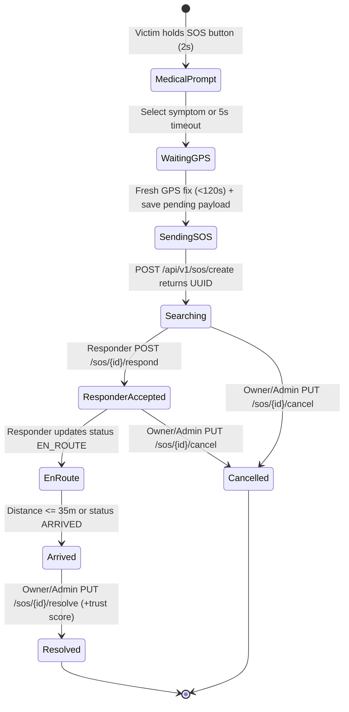
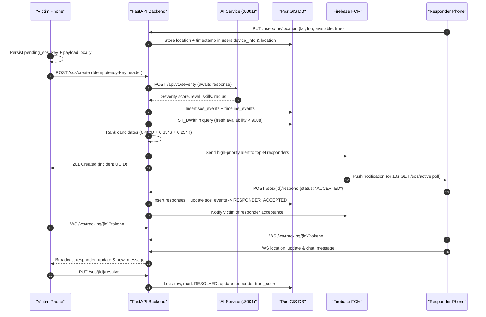
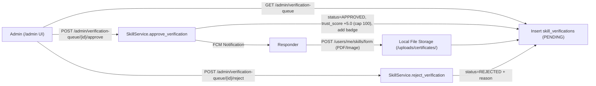

# 6. Important User Workflows

## 6.1 Victim SOS Lifecycle & Responder Coordination

```mermaid
stateDiagram-v2
    [*] --> MedicalPrompt: Victim holds SOS button (2s)
    MedicalPrompt --> WaitingGPS: Select symptom or 5s timeout
    WaitingGPS --> SendingSOS: Fresh GPS fix (<120s) + save pending payload
    SendingSOS --> Searching: POST /api/v1/sos/create returns UUID
    Searching --> ResponderAccepted: Responder POST /sos/{id}/respond
    ResponderAccepted --> EnRoute: Responder updates status EN_ROUTE
    EnRoute --> Arrived: Distance <= 35m or status ARRIVED
    Arrived --> Resolved: Owner/Admin PUT /sos/{id}/resolve (+trust score)
    Searching --> Cancelled: Owner/Admin PUT /sos/{id}/cancel
    ResponderAccepted --> Cancelled: Owner/Admin PUT /sos/{id}/cancel
    Resolved --> [*]
    Cancelled --> [*]
```

## 6.2 Two-Client End-to-End Rescue Flow

```mermaid
sequenceDiagram
    autonumber
    participant Victim as "Victim Phone"
    participant Backend as "FastAPI Backend"
    participant AI as "AI Service (:8001)"
    participant DB as "PostGIS DB"
    participant FCM as "Firebase FCM"
    participant Responder as "Responder Phone"

    Responder->>Backend: PUT /users/me/location {lat, lon, available: true}
    Backend->>DB: Store location + timestamp in users.device_info & location

    Victim->>Victim: Persist pending_sos_key + payload locally
    Victim->>Backend: POST /sos/create (Idempotency-Key header)
    Backend->>AI: POST /api/v1/severity (awaits response)
    AI-->>Backend: Severity score, level, skills, radius
    Backend->>DB: Insert sos_events + timeline_events
    Backend->>DB: ST_DWithin query (fresh availability < 900s)
    Backend->>Backend: Rank candidates (0.40*D + 0.35*S + 0.25*R)
    Backend->>FCM: Send high-priority alert to top-N responders
    Backend-->>Victim: 201 Created (incident UUID)

    FCM-->>Responder: Push notification (or 10s GET /sos/active poll)
    Responder->>Backend: POST /sos/{id}/respond {status: "ACCEPTED"}
    Backend->>DB: Insert responses + update sos_events -> RESPONDER_ACCEPTED
    Backend->>FCM: Notify victim of responder acceptance

    Victim->>Backend: WS /ws/tracking/{id}?token=...
    Responder->>Backend: WS /ws/tracking/{id}?token=...
    Responder->>Backend: WS location_update & chat_message
    Backend-->>Victim: Broadcast responder_update & new_message
    Victim->>Backend: PUT /sos/{id}/resolve
    Backend->>DB: Lock row, mark RESOLVED, update responder trust_score
```

## 6.3 Admin Moderation & Skill Verification Workflow

```mermaid
flowchart LR
    User["Responder"] -->|"POST /users/me/skills/form (PDF/Image)"| Uploads["Local File Storage (/uploads/certificates/)"]
    Uploads --> DB["Insert skill_verifications (PENDING)"]
    Admin["Admin (/admin UI)"] -->|"GET /admin/verification-queue"| DB
    Admin -->|"POST /admin/verification-queue/{id}/approve"| SkillSvc["SkillService.approve_verification"]
    SkillSvc -->|"status=APPROVED, trust_score +5.0 (cap 100), add badge"| DB
    SkillSvc -->|"FCM Notification"| User
    Admin -->|"POST /admin/verification-queue/{id}/reject"| SkillSvc2["SkillService.reject_verification"]
    SkillSvc2 -->|"status=REJECTED + reason"| DB
```
