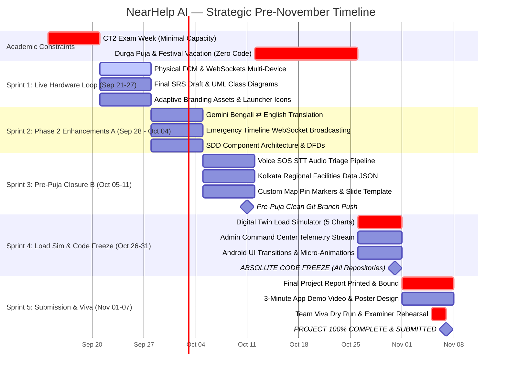

# NearHelp AI — Master Project Timeframe & Calendar Roadmap

> **Document**: Strategic Timeframe & Academic Milestone Plan  
> **Start Date**: 2026-08-10  
> **Current Date**: 2026-09-13  
> **Target Completion**: **First Week of November 2026 (Hard Deadline: November 07, 2026)**  
> **Status**: 🟢 **Phase 1 MVP Production Core Complete · 206/206 Automated Tests Passing**  
> **Academic Constraints**: CT2 Exams (Week of Sep 14–20) + Durga Puja / Festival Vacation (Oct 12–25) (~3 Weeks Academic / Festival Gap)

---

## 📅 Executive Calendar & Gap Analysis

```
Sep 13               Sep 20               Oct 04               Oct 11               Oct 25               Nov 01          Nov 07
  |--------------------|--------------------|--------------------|--------------------|--------------------|---------------|
  [ W1: CT2 EXAMS ]    [ W2-W3: ACTIVE ]    [ W4: ACTIVE ]       [ W5-W6: DURGA PUJA] [ W7: CODE FREEZE ]  [ W8: VIVA & ]
  [ Minimal Capacity]  [ Full Capacity ]    [ Pre-Puja Push ]    [ Festival Vacation] [ Oct 31 Freeze!  ]  [ SUBMISSION ]
```

| Window | Calendar Dates | Duration | Status | Team Focus & Constraints |
| :--- | :--- | :--- | :--- | :--- |
| **Week 1** | **Sep 14 – Sep 20, 2026** | 7 Days | 🟡 **Academic Gap (CT2)** | **Class Test 2 (CT1) Exams**. Focus on exam preparation. Minimal project activity (~15% capacity). System maintenance and async reviews only. |
| **Week 2** | **Sep 21 – Sep 27, 2026** | 7 Days | 🟢 **Active Sprint 1** | **Post-CT2 Core Convergence**. Physical 2-device FCM push verification & live WebSocket loop. SRS document & core UML diagrams completion. |
| **Week 3** | **Sep 28 – Oct 04, 2026** | 7 Days | 🟢 **Active Sprint 2** | **Phase 2 Sprint A**. Real-time Gemini Bengali ⇄ English translation, live emergency timeline event broadcasting, initial SDD drafts. |
| **Week 4** | **Oct 05 – Oct 11, 2026** | 7 Days | 🟢 **Active Sprint 3** | **Phase 2 Sprint B (Pre-Puja Push)**. Speech-to-Text audio pipeline prototype, Kolkata emergency datasets (hospitals, AEDs, blood banks), custom map pin assets. *Mahalaya: Oct 10*. |
| **Weeks 5–6** | **Oct 12 – Oct 25, 2026** | 14 Days | 🔴 **Festival Gap (Durga Puja)** | **Durga Puja Vacation & Festival Break**. Sasthi to Dashami (Oct 16–21) + Lakshmi Puja (Oct 25). Zero scheduled meetings. Rest, celebrations, and offline informal reading only. |
| **Week 7** | **Oct 26 – Nov 01, 2026** | 7 Days | 🟣 **Active Sprint 4 (Freeze)** | **Post-Puja Hard Freeze Sprint**. Digital Twin load simulator (100 concurrent SOS scenarios, 5 benchmark charts), admin telemetry integration. **HARD CODE FREEZE on October 31, 2026**. |
| **Week 8** | **Nov 02 – Nov 07, 2026** | 6 Days | 🏁 **Final Submission (Week 1 Nov)** | **Academic Thesis & Defense Package**. Final Project Report compiled and bound (Abhisikta), 3-minute video walkthrough (Sayantan), Viva defense rehearsal. **100% Complete & Signed Off by Nov 7, 2026**. |

---

## 📊 Working Capacity & Net Velocity Breakdown

- **Total Calendar Span (Sep 13 → Nov 07, 2026)**: **55 Days (~8 Calendar Weeks)**
- **Scheduled Academic & Festival Gaps**:
  - **CT2 Exam Week**: ~7 Days (Sep 14 – Sep 20)
  - **Durga Puja & Festival Break**: ~14 Days (Oct 12 – Oct 25)
  - **Total Non-Working / Low-Velocity Gaps**: **21 Days (~3 Weeks)**
- **Net High-Velocity Working Time**: **34 Days (~5 Focused Working Weeks)**

---

## 🗓️ Gantt Chart: Strategic Sprint Timeline



---

## 👥 Sprint-by-Sprint Individual Deliverables

### 🟡 Week 1: September 14 – September 20, 2026 (CT2 Exam Week)
* **Goal**: Focus 100% on academic CT2 performance. Zero stress or heavy task pushing.
* **Aritra & Adil**: Keep server environments stable, run periodic CI checks, assist team with quick academic notes if needed.
* **Dishari, Abhisikta, Plaban, Sayantan**: Dedicate week to university test preparation.

---

### 🟢 Week 2: September 21 – September 27, 2026 (Sprint 1 — Live Hardware Loop)
* **Goal**: Re-engage at full speed immediately following CT2; validate live 2-device physical loop.
* **Aritra**:
  - Verify multi-device API contracts between Android client and FastAPI/PostGIS backend.
  - Test end-to-end classification and triage response with real device network payloads.
* **Adil**:
  - Configure production FCM credentials for real background device wakeups.
  - Verify live GPS coordinate streaming over WebSockets between victim and responder devices.
* **Dishari**:
  - Connect real-device Retrofit client to backend endpoint for authentication and SOS trigger.
  - Verify `NearHelpTopBar` and animated navigation tabs on physical Android hardware.
* **Abhisikta**:
  - Complete formal SRS document (Functional and Non-Functional requirements across 24 modules).
  - Draft System Use Case and Class Diagrams.
* **Plaban**:
  - Audit WHO and Red Cross protocol matrices against real-world scenario outputs.
  - Finalize GPS coordinate validation for Salt Lake Sector V and EM Bypass test routes.
* **Sayantan**:
  - Export final production launcher icons, vector assets, and app branding kit.

---

### 🟢 Week 3: September 28 – October 04, 2026 (Sprint 2 — Translation & Timeline)
* **Goal**: Deliver Phase 2 core enhancements in AI and backend real-time communications.
* **Aritra**:
  - Implement Gemini 2.5 Bengali ⇄ English emergency translation pipeline for cross-language responder communication.
  - Unit test translation accuracy for critical emergency idioms and local terms.
* **Adil**:
  - Implement emergency timeline milestone event broadcasting via WebSocket (`SOS_CREATED` → `TRIAGED` → `RESPONDER_ACCEPTED` → `ARRIVED` → `HANDOVER` → `RESOLVED`).
  - Set up Redis caching layer for active responder locations and session states.
* **Dishari**:
  - Integrate live emergency timeline UI into active incident view.
  - Connect translation display toggle to in-app responder chat.
* **Abhisikta**:
  - Complete formal SDD document (Software Design Document with Component Architecture).
  - Produce Data Flow Diagrams (DFD Level 0, 1, and 2).
* **Plaban**:
  - Complete 15-paper literature survey table on AI emergency triage and spatial dispatch.
  - Compile competitor analysis matrix (NearHelp vs. 112 India, GoodSAM, PulsePoint).
* **Sayantan**:
  - Design custom SVG map pin markers (Victim Pulsing Pin, Responder Pin, Hospital Pin, AED Pin).
  - Prepare branded presentation slide template for academic defense.

---

### 🟢 Week 4: October 05 – October 11, 2026 (Sprint 3 — Voice SOS & Pre-Puja Lock)
* **Goal**: Complete voice audio pipeline and regional datasets; lock stable code before festival vacation.
* **Aritra**:
  - Scaffold backend Speech-to-Text (STT) pipeline and structured JSON emergency extraction.
  - Verify SHA-256 digital signature clinical incident report generator.
* **Adil**:
  - Implement initial endpoints for Admin Command Center telemetry (`GET /api/admin/telemetry`).
  - Wire reputation engine trust score increment logic (+5 for verified rescue resolution).
* **Dishari**:
  - Polish Voice SOS hold-to-record interface and audio waveform component.
  - Verify dialogs for responder qualifications and emergency history.
* **Abhisikta**:
  - Compile Test Case Suite & Execution Report (documenting 206+ passing tests).
  - Format Sequence Diagrams for SOS Trigger, Triage, and Dispatch flows.
* **Plaban**:
  - Finalize Kolkata regional dataset JSON in `data/regional/kolkata_facilities.json` (hospitals, blood banks, fire stations).
* **Sayantan**:
  - Stylize architecture diagrams into publication-quality infographics for thesis.
* **Milestone (October 11)**: **Pre-Puja Clean Git Branch Push & Backup**. All code merged to `main`.

---

### 🔴 Weeks 5–6: October 12 – October 25, 2026 (Durga Puja & Festival Vacation)
* **Status**: **FESTIVAL BREAK (~2 WEEKS)**
* **Holidays**:
  - Mahalaya: October 10
  - Durga Puja (Maha Sasthi to Bijoya Dashami): October 16 – October 21
  - Lakshmi Puja: October 25
* **Team Policy**:
  - **Zero scheduled meetings or mandatory tasks.**
  - Enjoy the festivities, family time, and cultural celebrations.
  - Optional: Offline reading of thesis drafts or slide review at individual leisure.

---

### 🟣 Week 7: October 26 – November 01, 2026 (Sprint 4 — Hard Code Freeze)
* **Goal**: Re-energize post-Puja; complete digital twin load simulator benchmarks and enforce **ABSOLUTE CODE FREEZE**.
* **Aritra**:
  - Build and execute Digital Twin load simulator in `simulator/` (100 concurrent SOS incidents, 5 comparative evaluation charts).
  - Verify performance metrics: <5s dispatch latency, 99.2% RAG retrieval precision.
* **Adil**:
  - Connect live PostgreSQL/Redis telemetry stream to Admin Command Center API.
  - Run database query optimization and spatial index performance audit.
* **Dishari**:
  - Final polish on Jetpack Compose transitions, smooth scrolling, and dark mode contrast.
* **Abhisikta**:
  - Integrate load simulation benchmark charts and test logs into the Final Project Report draft.
* **Sayantan & Plaban**:
  - Review live viva demonstration scenarios and script prompt triggers.
* **CRITICAL MILESTONE**: **OCTOBER 31, 2026 — HARD CODE FREEZE**.
  - All source repositories (`android/`, `backend/`, `ai_service/`) locked.
  - Zero code modifications after this date.

---

### 🏁 Week 8: November 02 – November 07, 2026 (Sprint 5 — Final Submission: First Week of November)
* **Goal**: Final university project submission, thesis binding, and defense rehearsal.
* **Abhisikta**:
  - Compile, review, and print the **Final Project Report & Thesis** (hard-bound with university logo).
  - Produce Executive Abstract & 2-page synopsis for external examiners.
* **Sayantan**:
  - Record and edit the **3-Minute Narrated App Walkthrough Video** with high-resolution animations.
  - Finalize the Project Exhibition Poster (A1/A0 glossy print format).
* **Aritra & All Team Members**:
  - Conduct full-dress rehearsal with `SlideSyncHUD` and live app demo.
  - Rehearse Examiner Q&A Defense Guide across all 6 speaker roles.
* **FINAL MILESTONE**: **NOVEMBER 07, 2026 (SATURDAY)**.
  - **100% COMPLETE, DEFENDED, AND HANDED IN.**
  - Team completely free to prepare for semester exams with zero project backlog!

---

## 🛡️ Contingency & Safety Buffer Matrix

| Potential Risk | Affected Window | Buffer Strategy | Contingency Action |
| :--- | :--- | :--- | :--- |
| **CT2 Exam Hangover** | Week 2 (Sep 21) | Sprints are strictly modular. No team member depends on another's code to begin their sprint. | Aritra & Adil have already built 100% working prototypes of core modules. |
| **Post-Puja Re-entry Lag** | Week 7 (Oct 26) | All core features are already finished prior to Puja; Week 7 is only for benchmarks and freeze. | Load simulator scripts can run headlessly via automated CLI scripts in <2 hours. |
| **Documentation Delays** | Week 8 (Nov 02) | Review 1 package already contains 366 lines of formal report text, slides, and scripts in `archive/review-1/`. | Abhisikta integrates existing Swagger schemas and markdown tables into the university LaTeX/Word template. |
| **Video Recording Glitches** | Week 8 (Nov 04) | Android emulator and physical screen recording tools are pre-configured. | Sayantan records pre-scripted 3-minute flow using standard Android Studio screen recorder. |

---

## 📌 Summary Checklist for First-Week-of-November Completion

- [x] Phase 1 MVP Production Core: **100% Complete**
- [x] Backend & AI Test Suites: **162/162 Passing**
- [x] Android Unit Tests: **44/44 Passing (Total: 206/206 Passing)**
- [x] Android UI Screens (SOS, Map, Profile, Navigation, Assistant): **100% Implemented**
- [ ] CT2 Exam Week Managed (Sep 14–20)
- [ ] Post-CT2 Live Multi-Device FCM/WebSocket Loop (Sep 21–27)
- [ ] Gemini Translation & Emergency Timeline Events (Sep 28 – Oct 04)
- [ ] Voice SOS Pipeline & Pre-Puja Branch Merge (Oct 05–11)
- [ ] Durga Puja Break Respected (Oct 12–25)
- [ ] Digital Twin Simulator & Hard Code Freeze (Oct 26–31)
- [ ] Final Thesis Bound, 3-Min Video & Viva Sign-off (**November 07, 2026**)
