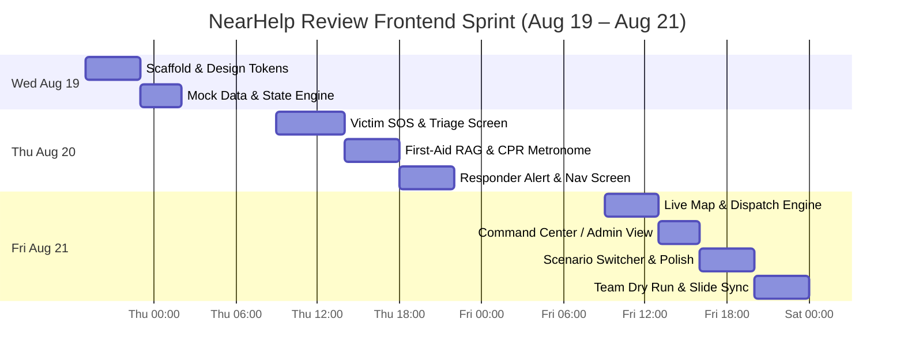

# 🚨 NearHelp AI — Friday Demo Frontend Master TODOs (`friday_todos.md`)

> **Target Review Date**: Saturday, 22 August 2026 (8:00 AM – 11:00 AM • Room 401)  
> **Frontend Completion Deadline**: **Friday, 21 August 2026 (11:59 PM)**  
> **Core Objective**: Build a **Showcase-Ready, Zero-Fail Interactive Demo Frontend** ("Show Mode") for the Project Review examiners.  
> **Key Strategy**: Fully functional, high-fidelity interactive UI with rich animations, simulated real-time dispatch telemetry, AI triage feedback, and pre-baked emergency scenarios so the live presentation never suffers from backend/network latency or API downtime.

---

## 🎯 Master Goal & Review Demo Strategy

The primary aim for Friday is to deliver a **jaw-dropping, polished frontend** that allows the team (Aritra, Dishari, Adil, Sayantan, Abhisikta, Plaban) to visually demonstrate every critical concept from the 8-slide presentation deck:
1. **Zero-Friction SOS Intake**: 1-Tap SOS, Multimodal Voice & Camera preview, Panic-Resilient UX.
2. **AI Triage & Severity Classification**: Instant Level 1–5 urgency calculation, symptoms extraction, clinical confidence badge.
3. **Interactive Grounded First-Aid Protocol**: Real-time RAG guidance with visual step-by-step checklist and rhythmic CPR metronome.
4. **Hyper-Local Spatial Dispatch & Live Tracking**: Interactive map displaying victim, expanding radial search (0.5km → 3km), CPR-verified responders, and live ETA tracking.
5. **Dual Persona Switching**: Instant toggle between **Victim View**, **Responder View**, and **Command Center / Admin Simulator**.
6. **Scenario Controller Bar**: 1-click preset selector to demonstrate real-world emergency simulations on demand during viva defense.

---

## 📊 High-Level Timeline (Wed Night → Friday Night)



---

## 📋 Comprehensive Checklist by Workstream

### 🎨 Phase 1: Design System, Tokens & Architecture (Wed Night)

- [x] 🔴 **Design System Foundations** (`theme.css` / Styling tokens)
  - [x] Configure High-Contrast Dark Theme (`#121212` background, `#1E1E1E` card surfaces)
  - [x] Implement Color Tokens:
    - 🚨 Emergency Red (`#E53935` / `#FF1744`) — Primary SOS & Level 5 Alerts
    - ⚠️ Action Amber (`#FF9800`) — Warning / Pending Dispatch / Level 3
    - 🟢 Safe Green (`#4CAF50`) — Verified Badges / Responder Arrived / Level 1
    - 🤖 AI Cyan/Blue (`#2196F3` / `#00E5FF`) — AI Triage & RAG Guidance Cards
  - [x] Load modern clean typography (`Inter`, `Plus Jakarta Sans`, `JetBrains Mono`)
  - [x] Configure pulsing radar animations & haptic/audio cue utilities

- [x] 🔴 **Demo State Store & Mock Engine** (`store/` or `state/`)
  - [x] Create Central Demo State Manager (Active Mode: `VICTIM` | `RESPONDER` | `COMMAND_CENTER`)
  - [x] Implement simulated emergency timer & auto-progression hooks (T+0s: SOS triggered → T+5s: AI Triaged → T+12s: Responder Accepted → T+25s: Arrived)
  - [x] Pre-configure 3 Complete Realistic Demo Scenarios:
    - **Scenario A**: *Critical Cardiac Arrest in Salt Lake Sector V* (Level 5, CPR needed, 2 nearby responders)
    - **Scenario B**: *Severe Arterial Bleed / Road Accident on EM Bypass* (Level 4, Tourniquet protocol, Ambulance routed)
    - **Scenario C**: *Offline Fallback Simulation* (Zero network → SMS/Mesh payload packet preview)

---

### 🚨 Phase 2: Victim Experience Screens (Thu Morning & Afternoon)

- [x] 🔴 **Screen 1: One-Tap SOS Trigger Screen**
  - [x] Giant central SOS button with radial breathing/pulse glow animation
  - [x] 3-second hold / 5-second abort countdown ring with "Cancel (False Alarm)" protection
  - [x] Crisis category selector chips (`🩺 Medical`, `🔥 Fire`, `🛡️ Crime`, `🚗 Accident`)
  - [x] Multimodal intake simulator bar:
    - 🎙️ *Hold to Speak Voice SOS*: Animated audio visualizer waveform + simulated live speech transcript (*"My father collapsed, not breathing..."*)
    - 📸 *Scene Photo Intake*: Image drop/preview with AI bounding-box detection overlay
  - [x] Quick-access toggle for *Anonymous Emergency Mode* (privacy bypass)

- [x] 🔴 **Screen 2: Live AI Triage & Active SOS Screen**
  - [x] **AI Diagnostic Badge**: *Level 5 — Critical Life Threat (Suspected Cardiac Arrest / Hypoxia)*
  - [x] **Clinical Urgency Metrics**: Estimated Survival Window (Platinum 5 Mins Countdown), AI Confidence: `98.4%`
  - [x] **3-Tier Spatial Escalation Bar**:
    - `0–30s`: Scanning Community Network (500m → 1.5km)
    - `30–60s`: Auto-Escalation to 108/112 Municipal Ambulance Gateway
    - `Active`: AI Offline/Online Medical Protocol Activated
  - [x] **Emergency Contact Status**: SMS & WhatsApp beacon dispatched to family with live GPS tracking link

- [x] 🟡 **Screen 3: Interactive Grounded First-Aid Protocol (RAG Assist)**
  - [x] Step-by-Step interactive cards with clear action checklist (e.g. *Step 1: Check Carotid Pulse* → *Step 2: Start 30 Compressions*)
  - [x] **Live CPR Rhythm Metronome**: Visual flashing beat indicator + audio click at **110 BPM** (AHA/ERC guidelines)
  - [x] Medical Disclaimers & Legal Good Samaritan Act protection badge (Section 134A MV Act)
  - [x] Quick AI Assistant Chat Drawer for real-time bystander questions (*"Can I give water?" → "❌ NO. Do not administer liquids..."*)

---

### 🛡️ Phase 3: Responder Experience Screens (Thu Evening)

- [x] 🔴 **Screen 4: High-Priority Emergency Dispatch Alert Modal**
  - [x] Full-screen flashing emergency banner with audible tone trigger simulation
  - [x] Incident Summary Card: *Victim 420m away (2.5 mins walking)*, *Incident: Rajesh Sengupta, 54 M (Level 5 Cardiac Arrest)*, *Required Skill: CPR / First-Aid / Doctor*
  - [x] Action buttons: `[ ✅ Accept Dispatch ]` (with instant route calculation) and `[ ❌ Decline (Re-route) ]`

- [x] 🔴 **Screen 5: Active Rescue Navigation & Victim Profile**
  - [x] Route map showing responder location → victim location with live turn-by-turn simulation (SVG Vector Route Map)
  - [x] Encrypted Medical ID Reveal (Blood Type: `O+`, Known Allergies: `Penicillin`, Pacemaker: `None/Active`, Direct Kin Call & SMS)
  - [x] Responder Action Bar: `[ I Have Arrived on Scene ]`, `[ AED Attached ]`, `[ Handover to 108 Ambulance ]`, `[ Mark Resolved ]`
  - [x] Two-way Real-Time Incident Chat & Event Timeline (Automated timestamp milestones, auto-translation Bengali ⇄ English)

---

### 🗺️ Phase 4: Live Map, Dispatch Engine & Command Center (Fri Morning)

- [ ] 🔴 **Screen 6: Dynamic Community Geo-Map**
  - [ ] Interactive Map component (Leaflet / Mapbox / Canvas-rendered map)
  - [ ] Animated map layers:
    - 📍 Victim SOS Marker (pulsing red target)
    - 🏃 Nearby Active Responders (with green status beacons & skill badges: CPR, EMT, Doctor)
    - 🏥 Nearby Hospitals & Trauma Centers (with available bed count / distance)
    - ⚡ Nearest Automated External Defibrillator (AED) locations
  - [ ] Radial dispatch wave animation illustrating PostGIS `ST_DWithin` spatial query

- [ ] 🟡 **Screen 7: Admin / Emergency Dispatch Command Center**
  - [ ] Live System Telemetry Banner:
    - *Active Emergencies*: 3
    - *Network Bystanders Available*: 142
    - *Average Dispatch Latency*: 4.2s (vs. 15m municipal average)
    - *RAG Medical Accuracy Index*: 99.2%
  - [ ] Real-time incident feed table with live filter by severity (Level 1 to Level 5)
  - [ ] Post-incident report generator preview (AI auto-generated clinical handover PDF/Markdown)

---

### ✨ Phase 5: Demo Switcher, Aesthetics Polish & Projector Tuning (Fri Afternoon)

- [ ] 🔴 **Floating Demo Controller Bar** (Sticky bottom/top toolbar for seamless presenting)
  - [ ] Fast Persona Toggle: `[ 🧑 Victim Mode ]` | `[ 🚑 Responder Mode ]` | `[ 🛰️ Command Center ]`
  - [ ] Scenario Preset Buttons:
    - `[ 🫀 Demo 1: Cardiac Arrest (100% Flow) ]`
    - `[ 💥 Demo 2: Road Collision ]`
    - `[ 📵 Demo 3: Offline Mesh/SMS ]`
  - [ ] State Reset Button (`[ 🔄 Reset Demo ]`) to restart clean for examiners
  - [ ] Simulated Event Trigger buttons (`Trigger SOS`, `Responder Accept`, `Simulate 108 Handover`)

- [ ] 🟡 **Visual Polish & Micro-Interactions**
  - [ ] Glassmorphism overlays (`backdrop-blur-md`, subtle borders `border-white/10`)
  - [ ] Smooth transition animations between triage states (framer-motion or smooth CSS transitions)
  - [ ] High contrast text rendering formatted for classroom / auditorium 1080p projectors
  - [ ] Mobile Frame view toggle (Switch between Desktop Command Center and Mobile Smartphone Frame)

---

### 🎤 Phase 6: Team Dry Run & Slide Synchronization (Fri Night)

- [ ] 🔴 **Synchronize Frontend Demo with Master 8 Slides & Speaking Script**:
  - [ ] **Slide 1 & 2 (Aritra)**: Showcase One-Tap SOS, Problem of 4–6 min hypoxic window vs. instant bystander dispatch.
  - [ ] **Slide 3 (Abhisikta)**: Showcase Multimodal Intake, AI Triage Severity Level 5 Card, and clinical confidence score.
  - [ ] **Slide 5 & 6 (Plaban & Sayantan)**: Demonstrate Dual-State UI, AED locator, and Good Samaritan legal safety shield.
  - [ ] **Slide 7 (Adil & Dishari)**: Demonstrate PostGIS Radial Spatial search animation, WebSocket live GPS tracking stream, and Jetpack Compose design ergonomics.
  - [ ] **Slide 8 (Aritra & Abhisikta)**: Demonstrate End-to-End Resolution, Post-Incident Summary report, and 108 ambulance handover.
- [ ] 🔴 **Contingency & Offline Package**:
  - [ ] Ensure frontend runs 100% offline via local dev server (e.g. `npm run dev` or local build) with zero internet dependency.
  - [ ] Create pre-recorded 60-second backup video clip in case the projector disconnects.

---

## 📂 Deliverable File Structure Recommendation

```text
NearHelp/
├── friday_todos.md                 # << This master plan
├── admin_dashboard/                # Web showcase frontend (React/Vite or Next.js or Vanilla)
│   ├── src/
│   │   ├── components/
│   │   │   ├── victim/            # SOS Button, Triage Card, CPR Metronome, StepGuide
│   │   │   ├── responder/         # AlertModal, NavigationCard, MedicalIdView
│   │   │   ├── map/               # LiveGeoMap, PulseMarkers, SpatialRadiusCircle
│   │   │   ├── command/           # TelemetryDashboard, IncidentTable, ReportPreview
│   │   │   └── demo/              # ScenarioController, MobileDeviceFrame
│   │   ├── mock/                  # Scenarios JSON, simulated GPS coordinates, triage payloads
│   │   ├── store/                 # Demo state store (Zustand / React Context / Pinia)
│   │   └── styles/                # High-contrast dark theme & animations
│   └── package.json
└── Review/
    ├── 01_PROJECT_REVIEW_REPORT.md
    ├── 02_PRESENTATION_SLIDES.md
    └── 03_TEAM_SPEAKING_SCRIPT.md
```

---

## 🏆 Definition of Done (Friday 11:59 PM)

| Check | Criterion | Verification |
| :---: | :--- | :--- |
| ✅ | **Interactive Flow** | Can click SOS → see AI triage → hear/see CPR metronome → switch to responder → resolve incident in under 45 seconds. |
| ✅ | **Zero Backend Latency** | Instantaneous scenario simulation with zero network calls required. |
| ✅ | **Projector Visibility** | Tested in dark mode with high-contrast text and clean large buttons (visible from 15 feet away). |
| ✅ | **Slide Alignment** | Every speaker has a dedicated 30-second visual moment mapped to their presentation slide. |
| ✅ | **Zero Error Console** | Clean console logs, flawless navigation, smooth 60fps animations. |
